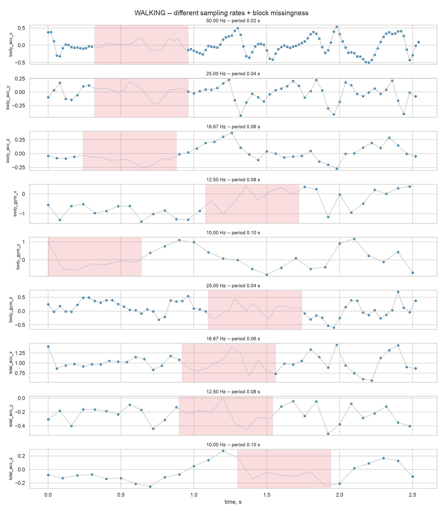
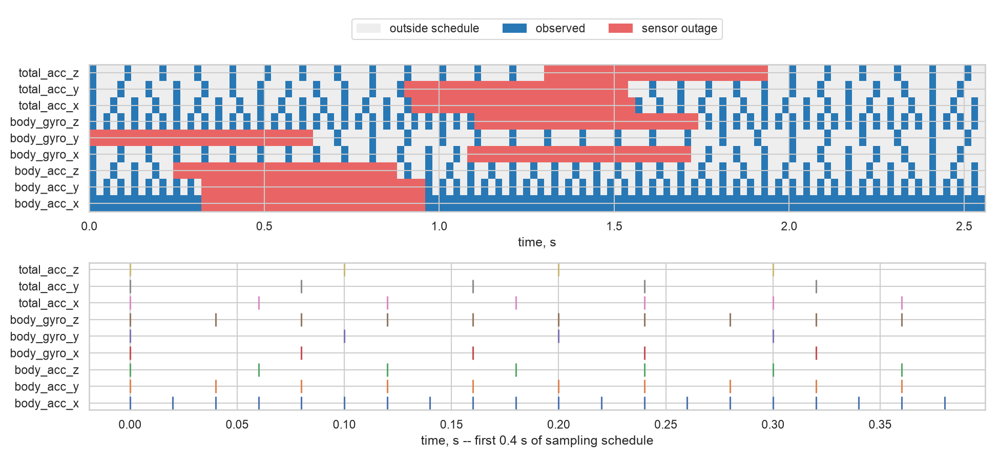
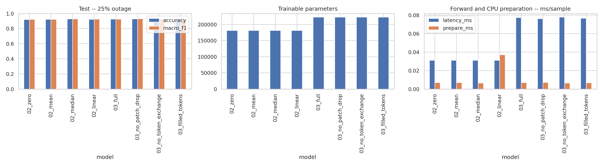
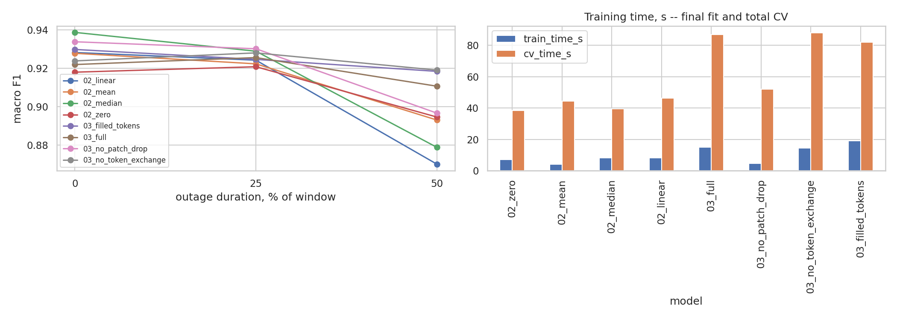
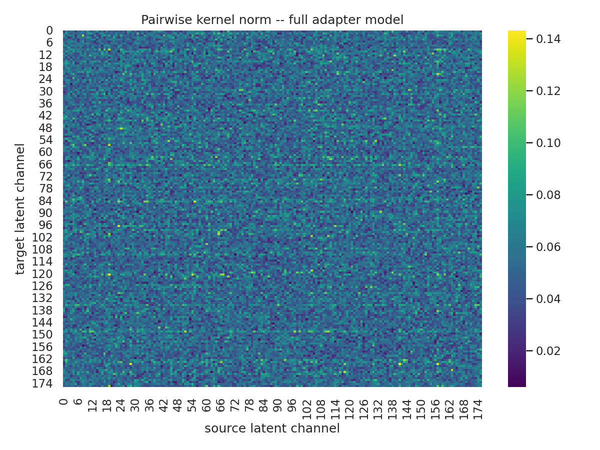

# ДЗ 2 -- ChannelTokenFormer на UCI HAR

> Сорочан Дмитрий, ПАДИИ3

## Задача

Проверяю обработку многомерного ряда с разными частотами и периодами пропусков.
Задача -- классификация шести активностей по девяти инерциальным каналам UCI HAR.
Использую официальные 7352 train / 2947 test окон по 128 отсчетов, 50 Гц.
Train и test разделены по людям.

## Данные

Частоты каналов: 50, 25, 16.67, 12.5, 10, 25, 16.67, 12.5, 10 Гц.
Перед прореживанием -- anti-aliasing FIR отдельно внутри окна, до имитации отказа.
В каждом train-окне каждого канала скрыт непрерывный интервал 0.64 с.
Test содержит те же окна в трех режимах: 0 / 0.64 / 1.28 с отказа.
Длинный test-пропуск расширяет короткий в обе стороны и включает его; у краев сдвигается внутрь окна.
Во всех режимах частоты уже различаются: 0% означает отсутствие отказов, а не исходные 50 Гц.
Это синтетические независимые от класса отказы на готовых окнах; они не моделируют все реальные причины потери данных.

## Модели

Pairwise EdgeMTSC получает четыре заполнения: физический ноль, train mean,
train median и линейную интерполяцию внутри окна. Во всех случаях один backbone:
ширины 176/44, pairwise temporal kernels на пяти лагах, SKB, LKB, два heads.
Заполняются как позиции вне расписания, так и интервалы отказа.

Новая модель -- **CTF-inspired adapter + Pairwise EdgeMTSC**.
Она берет sampling-aware patches, раздельное временное внимание,
channel tokens, маскирование пустых patches и случайное скрытие patches при обучении.
Размер patch определяется периодом дискретизации, FFT-подбор из статьи не воспроизводится.
Частично наблюдаемый patch получает маску отсчетов; пустой исключается из ключей внимания.
Позиции tokens сохраняются после маскирования. Ноль сам по себе не означает пропуск.

Это адаптация идей статьи, не оригинальный ChannelTokenFormer: channel tokens декодируются
в плотное представление отсутствующих позиций, которое поступает в неизмененный pairwise-backbone.
Наблюдаемые позиции сохраняются. Весь pipeline обучается по classification loss,
без доступа к скрытой истине и без обещания точного восстановления сигнала.
Межканальные kernels исходной CNN сохранены; дополнительно есть обмен между channel tokens.

## Контроль и абляции

- `03_full` -- adapter с маской и случайным скрытием patches (p=0.15).
- `03_no_patch_drop` -- та же модель без случайного скрытия, маска реальных пропусков остается.
- `03_no_token_exchange` -- отключен обмен между channel tokens; pairwise-backbone остается общим.
- `03_filled_tokens` -- те же параметры adapter, но нулевые входы считаются обычными tokens; без patch dropout.

`no_patch_drop` vs `filled_tokens` изолирует учет наблюдаемости внутри adapter.
`full` vs `no_patch_drop` изолирует дополнительную обучающую маскировку.
`full` vs `no_token_exchange` проверяет дополнительный обмен при обработке пропусков,
а не полное отсутствие межканальных связей во всей модели.
Прямое сравнение baseline и full -- сравнение pipelines, не чистый эффект одного attention mask:
число параметров различается. Контроль с тем же adapter нужен именно для этого ограничения.

## Протокол без утечек

Три GroupKFold на official train по subject_id. Окна одного человека не переходят между fit и validation.
Среднее, медиана и std считаются только по наблюдениям текущего fit fold.
Для финального обучения статистики заново считаются на всем official train.
Test не участвует в выборе заполнения, early stopping, числе эпох или нормализации.
Все восемь конфигураций и три test-сценария заданы заранее.

AdamW, lr=8e-4, weight decay=1e-3, batch=128, максимум 35 эпох, patience=7,
label smoothing=0.05, gradient clipping=1.0. Один seed=42, в CV seed=43/44/45.
Число финальных эпох -- медиана лучших эпох по CV macro F1; финальная модель обучается с нуля.
Cosine scheduler имеет одинаковый горизонт 35 эпох в CV и финальном обучении.
Основная метрика -- macro F1, также accuracy и balanced accuracy.

Линейная интерполяция использует только наблюдения текущего окна, края продолжает ближайшим значением.
Полностью пустой канал заполняется train mean. Двусторонняя интерполяция допустима
для offline-классификации целого окна; этот протокол не заявляет причинное online-предсказание.

Время обучения включает цикл fit (для CV также validation); отдельно сохраняется сумма CV.
Latency -- прогретый forward на устройстве, мс/объект в batch, с синхронизацией CUDA/MPS.
CPU-подготовка и нормализация измерены отдельно, загрузка файлов и перенос batch не входят в latency.
Это throughput-normalized latency, не задержка одного запроса. Без смешанной точности и компиляции.
Train time зависит и от выбранного по CV числа эпох, поэтому архитектурную стоимость сравниваю прежде всего по параметрам и latency.
CV std смешивает различия трех held-out групп людей и fold seeds; это не доверительный интервал и не отдельная оценка seed-устойчивости.

## Результаты

<!-- RESULTS_START -->
### Вычислительная конфигурация

Все восемь запусков выполнены в одной конфигурации.

```json
{
  "device": "mps",
  "platform": "macOS-15.7.7-arm64-arm-64bit-Mach-O",
  "machine": "arm64",
  "processor": "arm",
  "python": "3.14.6",
  "torch": "2.14.0",
  "numpy": "2.5.3",
  "threads": 10,
  "accelerator": "mps"
}
```

### Наблюдаемые train-каналы

| channel | sampling_hz | mean | median | std | lost_scheduled_pct |
| --- | --- | --- | --- | --- | --- |
| body_acc_x | 50.0000 | -0.0007 | -0.0007 | 0.1947 | 25.0000 |
| body_acc_y | 25.0000 | -0.0004 | 0.0007 | 0.1220 | 25.0000 |
| body_acc_z | 16.6667 | 0.0001 | 0.0001 | 0.1036 | 24.8039 |
| body_gyro_x | 12.5000 | -0.0010 | 0.0000 | 0.3934 | 25.0000 |
| body_gyro_y | 10.0000 | -0.0005 | -0.0003 | 0.3224 | 24.6301 |
| body_gyro_z | 25.0000 | 0.0000 | 0.0004 | 0.2555 | 25.0000 |
| total_acc_x | 16.6667 | 0.8048 | 0.9570 | 0.4128 | 24.8184 |
| total_acc_y | 12.5000 | 0.0287 | -0.0854 | 0.3882 | 25.0000 |
| total_acc_z | 10.0000 | 0.0866 | 0.0356 | 0.3547 | 24.6061 |

### Основной test, 25% отказа

| model | cv_f1_mean | cv_f1_std | accuracy | balanced_accuracy | macro_f1 | params | final_epochs | train_time_s | cv_time_s | latency_ms | prepare_ms |
| --- | --- | --- | --- | --- | --- | --- | --- | --- | --- | --- | --- |
| 02_zero | 0.9333 | 0.0457 | 0.9189 | 0.9216 | 0.9207 | 181376 | 5 | 7.1499 | 38.3922 | 0.0312 | 0.0071 |
| 02_mean | 0.9329 | 0.0444 | 0.9209 | 0.9226 | 0.9222 | 181376 | 3 | 4.0352 | 44.4116 | 0.0310 | 0.0070 |
| 02_median | 0.9366 | 0.0448 | 0.9284 | 0.9282 | 0.9288 | 181376 | 6 | 8.0670 | 39.3769 | 0.0311 | 0.0065 |
| 02_linear | 0.9314 | 0.0451 | 0.9230 | 0.9243 | 0.9242 | 181376 | 6 | 8.0730 | 46.2863 | 0.0312 | 0.0372 |
| 03_full | 0.9372 | 0.0336 | 0.9237 | 0.9257 | 0.9255 | 222624 | 6 | 14.8729 | 86.9734 | 0.0773 | 0.0071 |
| 03_no_patch_drop | 0.9357 | 0.0363 | 0.9287 | 0.9302 | 0.9301 | 222624 | 2 | 4.7601 | 51.9650 | 0.0762 | 0.0073 |
| 03_no_token_exchange | 0.9346 | 0.0372 | 0.9264 | 0.9280 | 0.9280 | 222624 | 6 | 14.5703 | 88.0202 | 0.0779 | 0.0064 |
| 03_filled_tokens | 0.9370 | 0.0427 | 0.9237 | 0.9244 | 0.9246 | 222624 | 8 | 19.2112 | 81.9787 | 0.0767 | 0.0069 |

### Устойчивость -- macro F1

| gap_pct | 02_linear | 02_mean | 02_median | 02_zero | 03_filled_tokens | 03_full | 03_no_patch_drop | 03_no_token_exchange |
| --- | --- | --- | --- | --- | --- | --- | --- | --- |
| 0 | 0.9281 | 0.9277 | 0.9386 | 0.9179 | 0.9297 | 0.9219 | 0.9337 | 0.9238 |
| 25 | 0.9242 | 0.9222 | 0.9288 | 0.9207 | 0.9246 | 0.9255 | 0.9301 | 0.9280 |
| 50 | 0.8701 | 0.8930 | 0.8788 | 0.8946 | 0.9183 | 0.9106 | 0.8966 | 0.9190 |

### Абляции -- разность macro F1

| gap_pct | full_minus_baseline | mask_minus_filled | patch_drop_effect | token_exchange_effect |
| --- | --- | --- | --- | --- |
| 0 | -0.0167 | 0.0040 | -0.0118 | -0.0019 |
| 25 | -0.0033 | 0.0055 | -0.0046 | -0.0024 |
| 50 | 0.0318 | -0.0217 | 0.0140 | -0.0084 |

### Эффект обмена по людям, 25% отказа

| subject | full_f1 | no_exchange_f1 | delta |
| --- | --- | --- | --- |
| 2 | 0.8722 | 0.8730 | -0.0008 |
| 4 | 0.8802 | 0.8710 | 0.0092 |
| 9 | 0.7703 | 0.7736 | -0.0033 |
| 10 | 0.7719 | 0.7542 | 0.0177 |
| 12 | 0.9966 | 0.9936 | 0.0029 |
| 13 | 0.9676 | 0.9643 | 0.0033 |
| 18 | 0.9649 | 0.9760 | -0.0111 |
| 20 | 0.9631 | 0.9879 | -0.0248 |
| 24 | 1.0000 | 1.0000 | 0.0000 |

### Выводы

По CV среди четырех способов заполнения выбран `02_median`: CV macro F1 = 0.9366.

При 0% отказа все каналы уже имеют разные частоты, но дополнительных блочных пропусков нет: выбранный baseline дает 0.9386, full CTF-inspired -- 0.9219. Поэтому на этом корпусе отдельного выигрыша от CTF-обработки только из-за несовпадающих частот не видно.

На основном test с отказом 25% выбранный baseline дает macro F1 = 0.9288, full CTF-inspired -- 0.9255, а вариант без patch dropout -- 0.9301. При умеренной missingness простая импутация остается конкурентоспособной; это описательное test-сравнение заранее заданных вариантов, а не дополнительный выбор модели по test.

При длинном отказе 50% full CTF-inspired выигрывает у CV-выбранного baseline: 0.9106 против 0.8788, delta = +0.0318. Patch dropout в этом режиме дает +0.0140 macro F1. Значит, специальная обработка отсутствующих временных patches становится полезнее, когда значительная часть временной структуры действительно потеряна.

Такой профиль результатов можно связать с природой UCI HAR. Это короткие окна физических инерциальных сигналов: соседние отсчеты локально зависимы, а несколько каналов дают частично избыточное описание одного движения. Кроме того, решается классификация целого окна, а не точная реконструкция скрытого сигнала. Поэтому при умеренных пропусках устойчивого типичного значения канала может быть достаточно для сохранения признаков класса. При 50% непрерывного outage полезной временной информации остается существенно меньше, и преимущество обучаемой обработки пропусков становится заметнее. Это интерпретация данного корпуса и протокола, а не общий вывод о превосходстве медианной импутации над ChannelTokenFormer-подобными методами.

Дополнительный обмен между channel tokens не улучшил aggregate macro F1 ни в одном из трех test-режимов: 0%: -0.0019, 25%: -0.0024, 50%: -0.0084. Это не означает, что межканальные связи бесполезны вообще: общий pairwise-backbone уже смешивает каналы, поэтому абляция измеряет только добавочный эффект token exchange поверх существующих связей.

Учет наблюдаемости внутри adapter относительно filled-tokens контроля дает +0.0055 macro F1 при 25% отказа, но -0.0217 при 50%. Поэтому отдельно маску нельзя назвать устойчиво полезной во всех режимах. Наиболее ясный положительный эффект full-конфигурации связан с train-time patch masking при тяжелых пропусках.

Цена full adapter -- 22.7% дополнительных параметров и примерно 2.48x forward latency относительно выбранного baseline на этом устройстве. Поэтому при умеренных пропусках усложнение здесь не окупается по качеству, а при тяжелых пропусках дает измеримый запас устойчивости. Train time напрямую не сравниваю как стоимость архитектуры, потому что число финальных эпох выбирается отдельно по CV.

При 25% отказа token exchange дал положительную разницу у 4 из 9 test subjects. Это описательный результат одного полного запуска; малые различия не трактую как статистически доказанный эффект.

**Практический итог:** для UCI HAR при умеренных интервальных пропусках разумно начинать с простой median-imputation как с сильного и дешевого baseline. CTF-inspired обработка оправдывается в этом эксперименте не как универсальная замена импутации, а как более устойчивый вариант при тяжелой потере временных участков.
### Графики











<!-- RESULTS_END -->

## Ограничения

Данные -- один корпус, окна короткие, отказы синтетические и независимы от класса.
Даже положительная разница не гарантирует перенос на реальные отказы датчиков.
Один seed не позволяет заявлять статистическую значимость малых различий.
Если эффект неодинаков при разных длительностях пропуска, вывод делаю отдельно по режимам.
Качество классификации не является оценкой качества восстановления скрытого сигнала.

## Источники

- [UCI HAR -- исходный корпус](https://archive.ics.uci.edu/dataset/240/human+activity+recognition+using+smartphones).
- [ChannelTokenFormer -- статья](https://arxiv.org/abs/2506.08660).
- [ChannelTokenFormer -- код авторов](https://github.com/jinkwan1115/ChannelTokenFormer).
