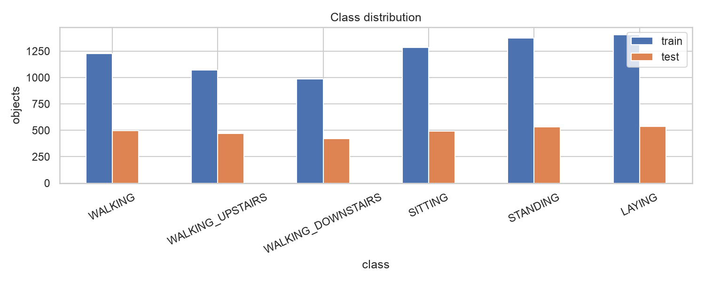
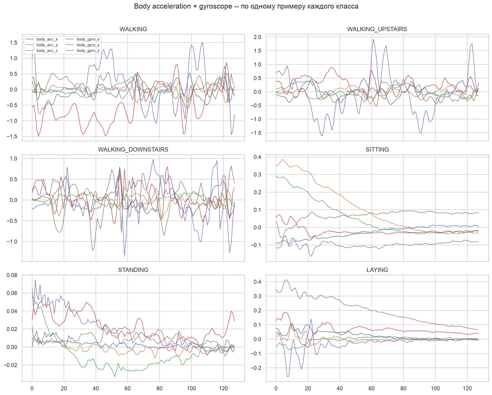
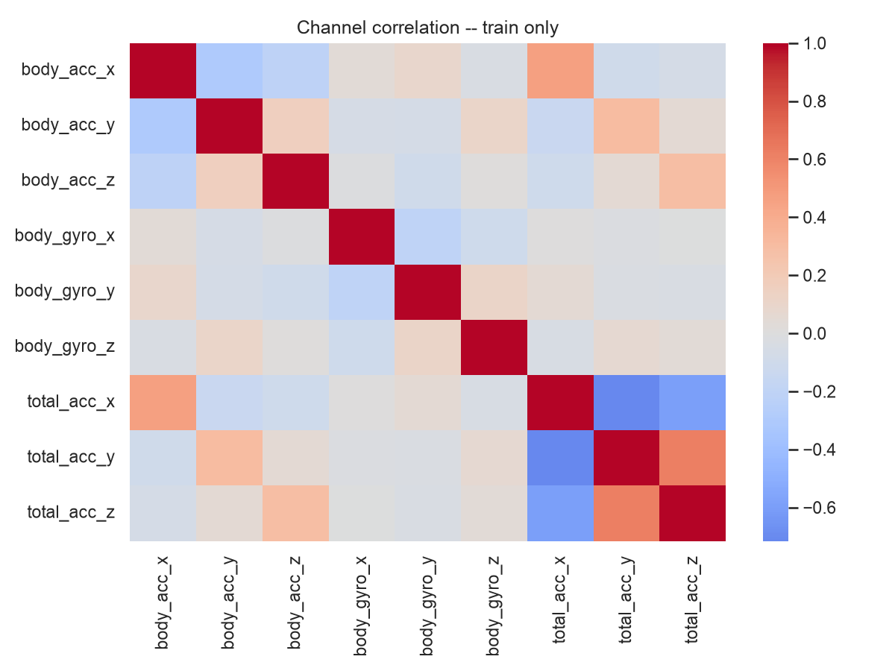
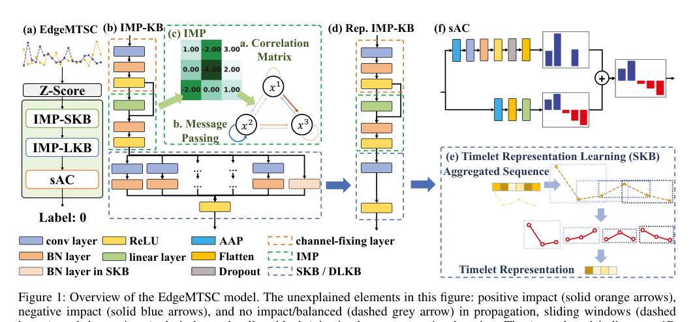
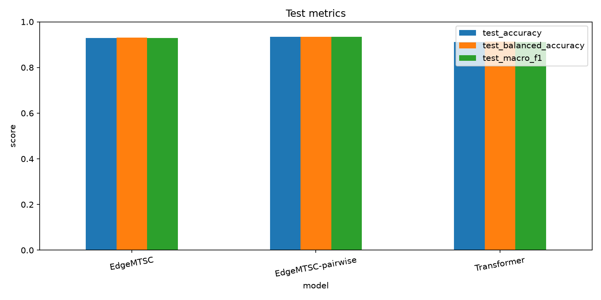
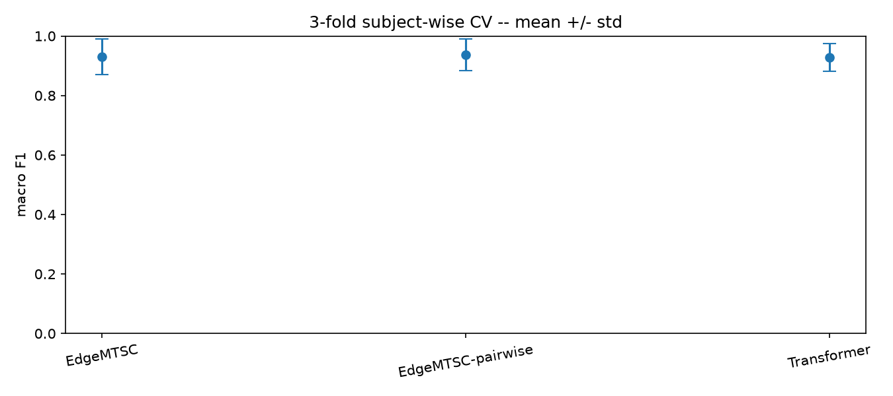
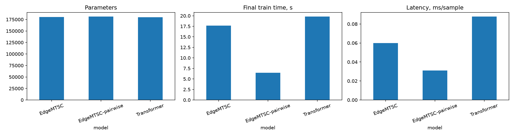
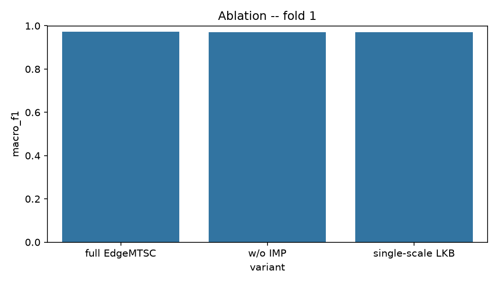
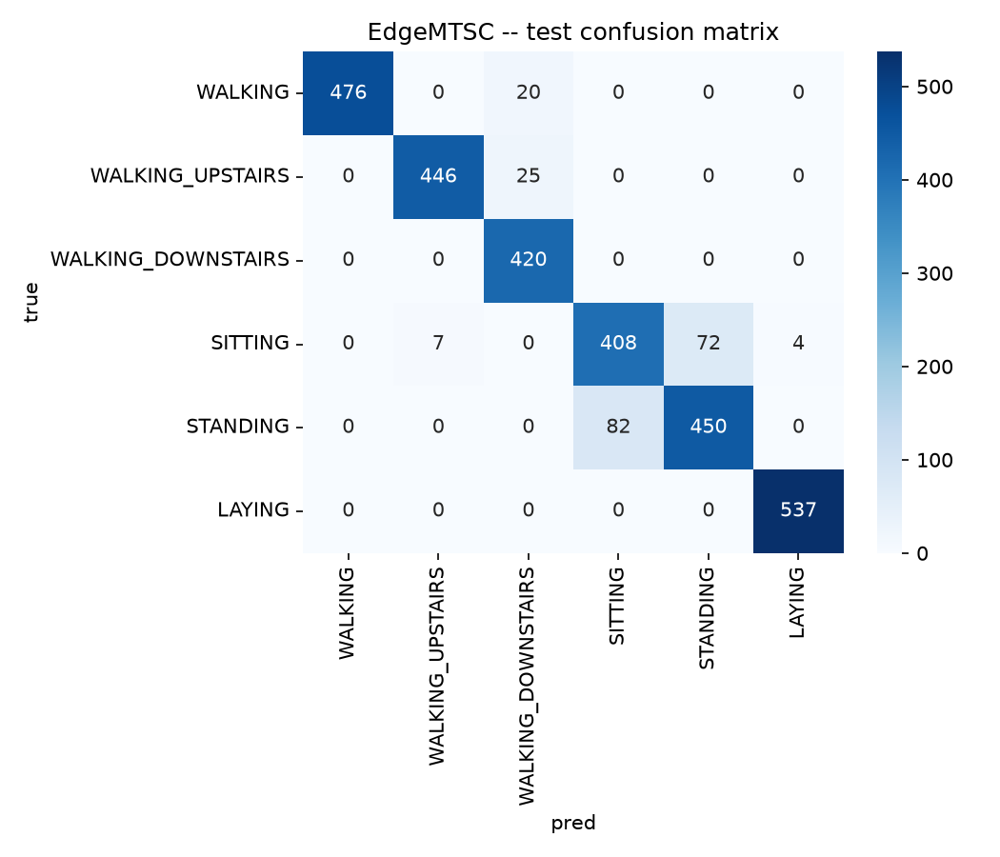
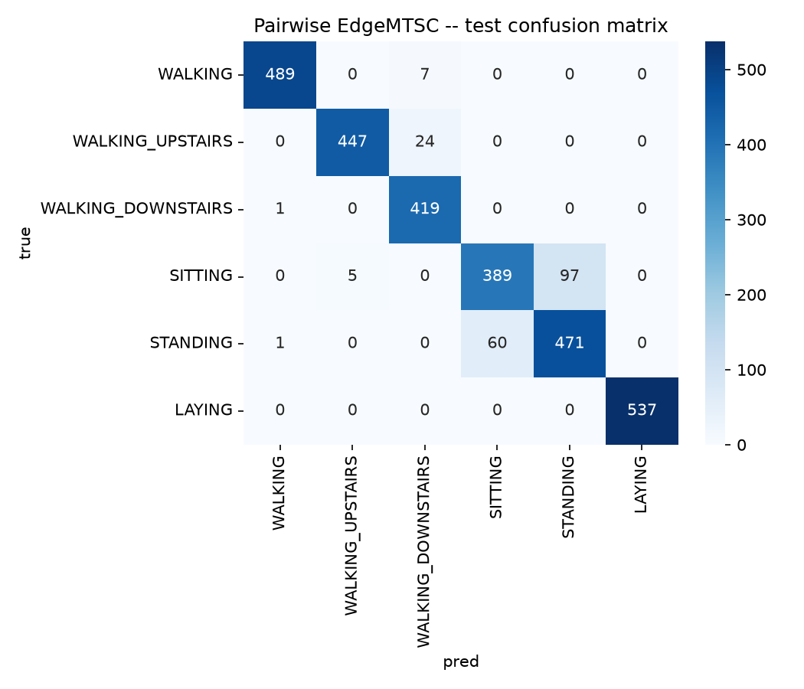

# ДЗ 1 -- EdgeMTSC на UCI HAR

> Сорочан Дмитрий, ПАДИИ3

## Постановка задачи

Проверяю EdgeMTSC на многомерных временных данных и отдельно исследую две идеи статьи: межканальные связи и разные temporal scales. Дополнительно проверяю свою модификацию -- отдельный локальный temporal operator для каждой пары latent channels.

Основные модели:

1. `EdgeMTSC` -- IMP + SKB + LKB + sAC по training topology официального repo;
2. `EdgeMTSC-pairwise` -- тот же общий pipeline, но IMP заменен на pairwise temporal kernels;
3. `Transformer` -- baseline без отдельного IMP, архитектура в стиле моей прошлой DL домашки.

## Вычислительная конфигурация

Все эксперименты запускаю локально на `MacBook Pro (Mac16,8)`:

- Apple M4 Pro;
- 14-core CPU (`10P + 4E`);
- 24 GB unified memory;
- PyTorch `MPS`;
- batch size `128`.

Модели специально держу примерно в одном budget около `180k` параметров: этого хватает для нормального качества на UCI HAR, а сравнение не упирается в разницу размеров сетей.

## Протокол обучения

Для всех трех основных моделей оставляю один протокол: `AdamW`, `lr=8e-4`, `weight_decay=1e-3`, `label_smoothing=0.05`, максимум `35` эпох и early stopping с `patience=7`. Валидацию делаю через 3-fold `GroupKFold` по людям.

## Корпус

Использую `UCI Human Activity Recognition Using Smartphones`.

- Hugging Face: https://huggingface.co/datasets/udayl/UCI_HAR
- UCI: https://archive.ics.uci.edu/dataset/240/human+activity+recognition+using+smartphones
- внешний raw-signal CNN sanity check: https://github.com/healthDataScience/deep-learning-HAR
- 7352 train / 2947 test;
- 9 каналов;
- 128 временных шагов;
- 6 классов;
- official split разделен по людям.

Корпус выбрал из-за сочетания размера, физически связанных sensor channels и нормального subject-independent split. Обучаю все локально на ноуте, поэтому не раздуваю модели без необходимости, но держу их около `180k` параметров -- полученного качества уже хватает для содержательного сравнения. Для raw `9 x 128` сигналов открытый 1D-CNN дает около `93%` accuracy, использую это только как внешний sanity check.

EDA находится в `notebooks/00_EDA.ipynb`.

## Валидация и leakage

Official test не участвует в нормализации, CV, early stopping, выборе числа эпох или параметров модели. В EDA использую его только для описания готового official split.

На official train делаю 3-fold `GroupKFold` по `subject_id`. На каждом fold z-score считаю только по fold-train. Для финального fit число эпох беру как медиану best epoch из CV, после чего обучаю модель на всем official train и считаю test для уже зафиксированной конфигурации.

`Accuracy` использую как headline-метрику для сравнения с HAR baseline. Для early stopping и основного сравнения моделей использую `macro F1`; дополнительно считаю `balanced accuracy`, per-class F1 и confusion matrix.

## Архитектуры

### EdgeMTSC

Официальный repo: https://github.com/HokyeeJau/EdgeMTSC

Сохраняю основные train-time блоки:

- channel-fixing `1x1 Conv`;
- IMP с residual;
- SKB с depthwise kernels `3` и `1`;
- LKB `K=47` + dilated branches `[5, 23, 3, 3, 3]` / dilations `[1, 2, 21, 19, 17]`;
- sAC из двух классификационных голов.

Structural re-parameterization не включаю -- здесь проверяю качество и идеи representation learning, а не отдельный deployment conversion.

### Pairwise EdgeMTSC

В standard IMP связь `source -> target` задается одним весом и одинаково действует во времени. В pairwise-варианте каждая пара latent channels получает свой kernel длины 5, то есть banded Toeplitz operator с лагами `[-2, -1, 0, +1, +2]`.

Чтобы сохранить общий budget около `180k`, pairwise backbone делаю уже (`176 -> 44` против `352 -> 88`). Поэтому это fixed-budget comparison двух конфигураций, а не чистая ablation одного оператора при одинаковой ширине сети.

### Transformer

Каждый timestamp -- токен из 9 sensor features. `Linear -> CLS + positional embedding -> 4 Transformer blocks -> classifier`.

Конфигурация: `dim=72`, `4 heads`, `depth=4`, `MLP ratio=2`.

## Результаты

| model | params | CV macro F1 | test accuracy | test balanced acc | test macro F1 | train, s/epoch | latency, ms/sample |
|---|---:|---:|---:|---:|---:|---:|---:|
| EdgeMTSC | 180,232 | 0.9300 +/- 0.0602 | 0.9287 | 0.9306 | 0.9293 | 1.96 | 0.0600 |
| EdgeMTSC-pairwise | 181,376 | 0.9374 +/- 0.0528 | 0.9338 | 0.9350 | 0.9345 | 1.61 | 0.0310 |
| Transformer | 179,718 | 0.9278 +/- 0.0475 | 0.9114 | 0.9125 | 0.9110 | 2.20 | 0.0878 |

У всех моделей второй subject fold заметно тяжелее первого и третьего. Поэтому большой CV std в первую очередь отражает inter-subject variability. Error bars перекрываются, так что небольшие различия CV mean не трактую как статистически надежное превосходство.

По test все три метрики дают один порядок: `EdgeMTSC-pairwise > EdgeMTSC > Transformer`. Standard EdgeMTSC выше Transformer по macro F1 на `+0.0184`, pairwise выше standard на `+0.0051`.

## Абляция EdgeMTSC

На первом subject-wise CV fold отдельно убираю IMP и multiscale dilated branches LKB.

| variant | macro F1 | params |
|---|---:|---:|
| full EdgeMTSC | 0.9723 | 180,232 |
| w/o IMP | 0.9705 | 48,072 |
| single-scale LKB | 0.9715 | 176,096 |

На этом fold `full - w/o IMP = +0.0019`, `full - single-scale LKB = +0.0008` macro F1. Обе разницы маленькие. Это вспомогательная ablation на одном fold, причем удаление IMP заметно уменьшает parameter count, поэтому не использую эти числа как сильное причинное доказательство. Для UCI HAR корректнее сказать, что отдельный эффект IMP и multiscale LKB здесь небольшой / неубедительный, а полный EdgeMTSC pipeline в целом работает лучше parameter-matched Transformer на official test.

## Анализ ошибок

### EdgeMTSC

### Pairwise EdgeMTSC

### Transformer

Во всех трех моделях основные ошибки приходятся на `SITTING` / `STANDING`. Динамические активности и `LAYING` распознаются заметно лучше. Это согласуется с EDA: статические сигналы похожи и отличаются тоньше, чем просто уровнем активности.

## Вывод

Лучший test macro F1 в этом запуске: `EdgeMTSC-pairwise` -- `0.9345`.

Результаты считаю нормальными: standard EdgeMTSC дает около `92.9%` accuracy, pairwise -- `93.4%`, то есть я попадаю в район внешнего raw-signal CNN sanity check. Увеличивать модели только потому, что полный прогон на MPS занимает несколько минут, смысла не вижу -- по learning curves они уже быстро сходятся, а качество не выглядит заниженным из-за слишком маленькой capacity.

Standard EdgeMTSC обходит parameter-matched Transformer на official test. Это поддерживает полный convolutional + channel-mixing inductive bias EdgeMTSC для сенсорных временных рядов, но короткая ablation не позволяет приписать весь выигрыш именно IMP или именно multiscale LKB.

Pairwise fixed-budget вариант дает еще `+0.0051` macro F1 относительно standard EdgeMTSC и лучший CV mean. Это небольшой, но содержательный выигрыш. По learned temporal matrix основная масса связи остается около главной диагонали, поэтому на этом корпусе полезнее выглядят локальные lag-aware relations, а не дальние временные переносы. Из-за разной ширины backbone этот эксперимент не является чистой заменой одного блока при полностью одинаковой архитектуре.

По ресурсам все три модели почти одинаковы по parameter count. Pairwise-вариант быстрее за эпоху и по inference latency, потому что fixed budget реализован более узким backbone. Полное final train time напрямую не сравниваю как скорость архитектуры: модели обучались разное число эпох.

## Что еще можно попробовать

- повторить основную таблицу по нескольким seeds;
- сделать ablation IMP / multiscale по всем subject folds, а не только по первому;
- проверить pairwise kernel `3 / 7 / 9` или dilated pairwise kernels;
- structural re-parameterization SKB/LKB и отдельное сравнение latency до/после merge;
- второй корпус из UEA, например `FingerMovements`, где авторы EdgeMTSC отдельно отмечают сильный эффект IMP.
